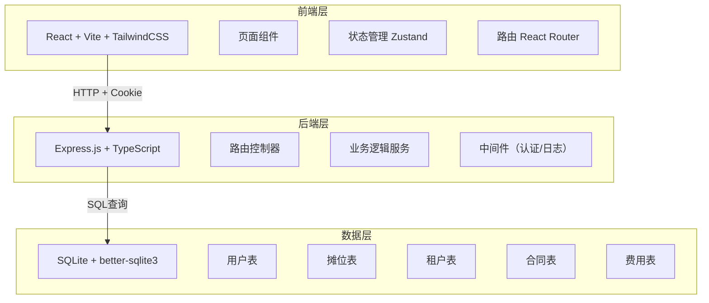
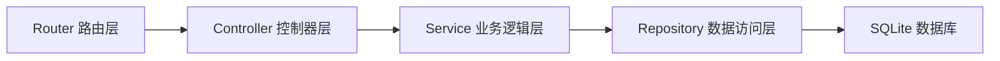
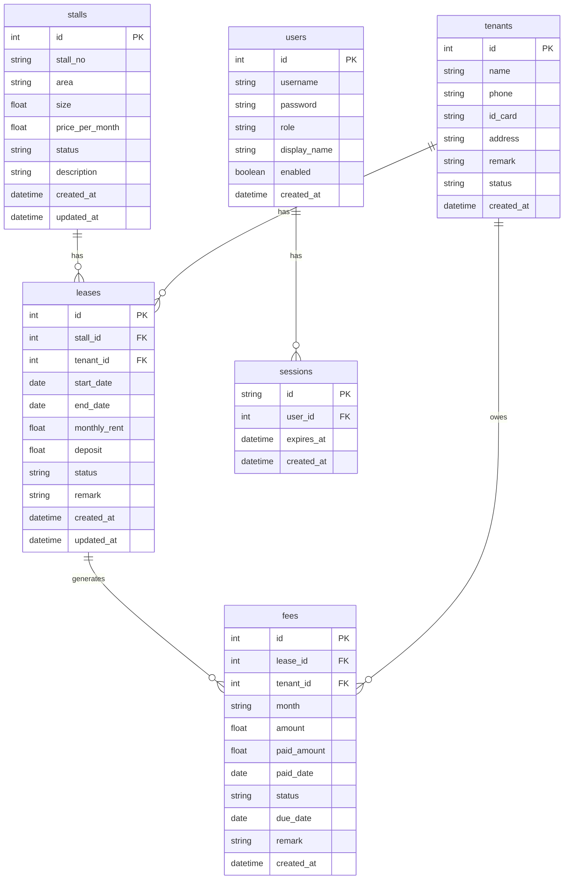

## 1. 架构设计



## 2. 技术说明

- **前端**: React@18 + TailwindCSS@3 + Vite + Zustand + React Router
- **初始化工具**: vite-init (react-express-ts 模板)
- **后端**: Express@4 + TypeScript (ESM格式)
- **数据库**: SQLite (better-sqlite3)，零配置，文件存储
- **认证**: Cookie-based Session (cookie-parser + 自定义session中间件)
- **图表**: Recharts
- **图标**: Lucide React

## 3. 路由定义

| 路由 | 用途 |
|------|------|
| `/login` | 登录页面 |
| `/` | 仪表盘首页 |
| `/stalls` | 摊位管理列表 |
| `/stalls/:id` | 摊位详情 |
| `/stalls/new` | 新增摊位 |
| `/tenants` | 租户管理列表 |
| `/tenants/:id` | 租户详情 |
| `/tenants/new` | 新增租户 |
| `/leases` | 租赁合同列表 |
| `/leases/new` | 签订合同 |
| `/leases/:id` | 合同详情 |
| `/finance` | 费用管理列表 |
| `/settings` | 系统设置 |
| `/settings/users` | 用户管理 |

## 4. API定义

### 4.1 认证相关

```typescript
// POST /api/auth/login
interface LoginRequest {
  username: string;
  password: string;
  remember?: boolean;
}
interface LoginResponse {
  success: boolean;
  user: { id: number; username: string; role: string; displayName: string };
}

// POST /api/auth/logout
interface LogoutResponse {
  success: boolean;
}

// GET /api/auth/me
interface MeResponse {
  user: { id: number; username: string; role: string; displayName: string };
}
```

### 4.2 摊位管理

```typescript
// GET /api/stalls?page=1&pageSize=20&area=&status=&keyword=
interface StallListResponse {
  data: Stall[];
  total: number;
  page: number;
  pageSize: number;
}

// GET /api/stalls/:id
interface StallDetailResponse {
  stall: Stall;
  leaseHistory: Lease[];
  feeRecords: Fee[];
}

// POST /api/stalls
interface CreateStallRequest {
  stallNo: string;
  area: string;
  size: number;
  pricePerMonth: number;
  description?: string;
}

// PUT /api/stalls/:id
interface UpdateStallRequest extends Partial<CreateStallRequest> {
  status?: 'vacant' | 'rented' | 'maintenance';
}

// DELETE /api/stalls/:id

interface Stall {
  id: number;
  stallNo: string;
  area: string;
  size: number;
  pricePerMonth: number;
  status: 'vacant' | 'rented' | 'maintenance';
  description?: string;
  currentTenantId?: number;
  currentTenantName?: string;
  createdAt: string;
  updatedAt: string;
}
```

### 4.3 租户管理

```typescript
// GET /api/tenants?page=1&pageSize=20&keyword=&status=
interface TenantListResponse {
  data: Tenant[];
  total: number;
}

// GET /api/tenants/:id
interface TenantDetailResponse {
  tenant: Tenant;
  currentLeases: Lease[];
  feeRecords: Fee[];
}

// POST /api/tenants
interface CreateTenantRequest {
  name: string;
  phone: string;
  idCard?: string;
  address?: string;
  remark?: string;
}

// PUT /api/tenants/:id

interface Tenant {
  id: number;
  name: string;
  phone: string;
  idCard?: string;
  address?: string;
  remark?: string;
  stallCount: number;
  status: 'active' | 'inactive';
  createdAt: string;
}
```

### 4.4 租赁管理

```typescript
// GET /api/leases?page=1&pageSize=20&status=
interface LeaseListResponse {
  data: Lease[];
  total: number;
}

// POST /api/leases
interface CreateLeaseRequest {
  stallId: number;
  tenantId: number;
  startDate: string;
  endDate: string;
  monthlyRent: number;
  deposit: number;
  remark?: string;
}

// POST /api/leases/:id/renew
interface RenewLeaseRequest {
  endDate: string;
  monthlyRent?: number;
}

// POST /api/leases/:id/terminate

interface Lease {
  id: number;
  stallId: number;
  stallNo: string;
  tenantId: number;
  tenantName: string;
  startDate: string;
  endDate: string;
  monthlyRent: number;
  deposit: number;
  status: 'active' | 'expiring' | 'expired' | 'terminated';
  remark?: string;
  createdAt: string;
}
```

### 4.5 费用管理

```typescript
// GET /api/fees?page=1&pageSize=20&status=&tenantId=&month=
interface FeeListResponse {
  data: Fee[];
  total: number;
}

// POST /api/fees/generate
interface GenerateFeesRequest {
  month: string; // YYYY-MM
}

// POST /api/fees/:id/pay
interface PayFeeRequest {
  paidAmount: number;
  paidDate: string;
  remark?: string;
}

// GET /api/fees/stats
interface FeeStatsResponse {
  totalReceivable: number;
  totalPaid: number;
  totalOverdue: number;
  overdueCount: number;
}

interface Fee {
  id: number;
  leaseId: number;
  tenantId: number;
  tenantName: string;
  stallNo: string;
  month: string;
  amount: number;
  paidAmount: number;
  paidDate?: string;
  status: 'unpaid' | 'partial' | 'paid' | 'overdue';
  dueDate: string;
  remark?: string;
  createdAt: string;
}
```

### 4.6 仪表盘

```typescript
// GET /api/dashboard/stats
interface DashboardStats {
  totalStalls: number;
  rentedStalls: number;
  vacantStalls: number;
  occupancyRate: number;
  monthlyReceivable: number;
  monthlyPaid: number;
  expiringLeases: Lease[];
  overdueTenants: { tenantName: string; stallNo: string; overdueAmount: number }[];
  occupancyTrend: { month: string; rate: number }[];
}
```

### 4.7 用户管理

```typescript
// GET /api/users
interface UserListResponse {
  data: User[];
}

// POST /api/users
interface CreateUserRequest {
  username: string;
  password: string;
  role: 'admin' | 'manager' | 'finance';
  displayName: string;
}

// PUT /api/users/:id
interface UpdateUserRequest {
  role?: string;
  displayName?: string;
  enabled?: boolean;
}

// PUT /api/users/:id/password
interface ChangePasswordRequest {
  oldPassword: string;
  newPassword: string;
}

interface User {
  id: number;
  username: string;
  role: string;
  displayName: string;
  enabled: boolean;
  createdAt: string;
}
```

## 5. 服务端架构图



## 6. 数据模型

### 6.1 数据模型定义



### 6.2 数据定义语言

```sql
CREATE TABLE users (
  id INTEGER PRIMARY KEY AUTOINCREMENT,
  username TEXT NOT NULL UNIQUE,
  password TEXT NOT NULL,
  role TEXT NOT NULL CHECK(role IN ('admin', 'manager', 'finance')),
  display_name TEXT NOT NULL,
  enabled INTEGER NOT NULL DEFAULT 1,
  created_at TEXT NOT NULL DEFAULT (datetime('now'))
);

CREATE TABLE sessions (
  id TEXT PRIMARY KEY,
  user_id INTEGER NOT NULL REFERENCES users(id),
  expires_at TEXT NOT NULL,
  created_at TEXT NOT NULL DEFAULT (datetime('now'))
);

CREATE TABLE stalls (
  id INTEGER PRIMARY KEY AUTOINCREMENT,
  stall_no TEXT NOT NULL UNIQUE,
  area TEXT NOT NULL,
  size REAL NOT NULL,
  price_per_month REAL NOT NULL,
  status TEXT NOT NULL DEFAULT 'vacant' CHECK(status IN ('vacant', 'rented', 'maintenance')),
  description TEXT,
  created_at TEXT NOT NULL DEFAULT (datetime('now')),
  updated_at TEXT NOT NULL DEFAULT (datetime('now'))
);

CREATE TABLE tenants (
  id INTEGER PRIMARY KEY AUTOINCREMENT,
  name TEXT NOT NULL,
  phone TEXT NOT NULL,
  id_card TEXT,
  address TEXT,
  remark TEXT,
  status TEXT NOT NULL DEFAULT 'active' CHECK(status IN ('active', 'inactive')),
  created_at TEXT NOT NULL DEFAULT (datetime('now'))
);

CREATE TABLE leases (
  id INTEGER PRIMARY KEY AUTOINCREMENT,
  stall_id INTEGER NOT NULL REFERENCES stalls(id),
  tenant_id INTEGER NOT NULL REFERENCES tenants(id),
  start_date TEXT NOT NULL,
  end_date TEXT NOT NULL,
  monthly_rent REAL NOT NULL,
  deposit REAL NOT NULL DEFAULT 0,
  status TEXT NOT NULL DEFAULT 'active' CHECK(status IN ('active', 'expiring', 'expired', 'terminated')),
  remark TEXT,
  created_at TEXT NOT NULL DEFAULT (datetime('now')),
  updated_at TEXT NOT NULL DEFAULT (datetime('now'))
);

CREATE TABLE fees (
  id INTEGER PRIMARY KEY AUTOINCREMENT,
  lease_id INTEGER NOT NULL REFERENCES leases(id),
  tenant_id INTEGER NOT NULL REFERENCES tenants(id),
  month TEXT NOT NULL,
  amount REAL NOT NULL,
  paid_amount REAL NOT NULL DEFAULT 0,
  paid_date TEXT,
  status TEXT NOT NULL DEFAULT 'unpaid' CHECK(status IN ('unpaid', 'partial', 'paid', 'overdue')),
  due_date TEXT NOT NULL,
  remark TEXT,
  created_at TEXT NOT NULL DEFAULT (datetime('now'))
);

-- 索引
CREATE INDEX idx_stalls_status ON stalls(status);
CREATE INDEX idx_stalls_area ON stalls(area);
CREATE INDEX idx_tenants_name ON tenants(name);
CREATE INDEX idx_tenants_phone ON tenants(phone);
CREATE INDEX idx_leases_stall_id ON leases(stall_id);
CREATE INDEX idx_leases_tenant_id ON leases(tenant_id);
CREATE INDEX idx_leases_status ON leases(status);
CREATE INDEX idx_fees_lease_id ON fees(lease_id);
CREATE INDEX idx_fees_tenant_id ON fees(tenant_id);
CREATE INDEX idx_fees_status ON fees(status);
CREATE INDEX idx_fees_month ON fees(month);
CREATE INDEX idx_sessions_user_id ON sessions(user_id);

-- 初始数据
INSERT INTO users (username, password, role, display_name) VALUES
  ('admin', 'e10adc3949ba59abbe56e057f20f883e', 'admin', '系统管理员');
  -- 默认密码: 123456 (MD5)
```
